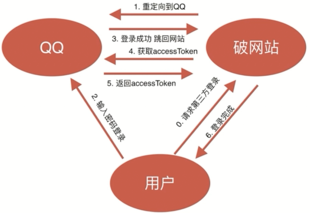
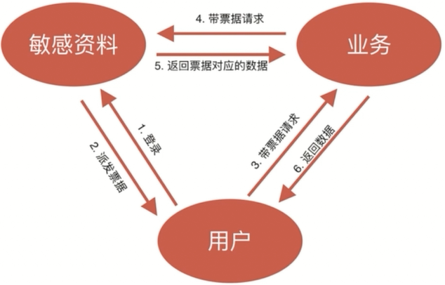

# OAuth

OAUTH协议为用户资源的授权提供了一个安全的、开放而又简易的标准。与以往的授权方式不同之处是OAUTH的授权不会使第三方触及到用户的帐号信息（如用户名与密码），即第三方无需使用用户的用户名与密码就可以申请获得该用户资源的授权，因此OAUTH是安全的。oAuth是Open Authorization的简写。OAuth2.0是OAuth协议的延续版本，但不向后兼容OAuth 1.0即完全废止了OAuth1.0

## 应用场景

- 第三方应用授权登录：在APP或者网页接入一些第三方应用时，时长会需要用户登录另一个合作平台，比如QQ，微博，微信的授权登录

- 原生app授权：app登录请求后台接口，为了安全认证，所有请求都带token信息，如果登录验证、请求后台数据。

- 前后端分离单页面应用（spa）：前后端分离框架，前端请求后台数据，需要进行oauth2安全认证，比如使用vue、react后者h5开发的app

## OAuth思想

- 一切行为由用户授权
- 授权行为不泄露敏感信息
- 授权会过期

## 使用OAuth思想防止资料泄露

- 用户授权读取资料
- 未授权的资料无法读取
- 不允许批量获取数据
- 数据接口可风控审计：通过票据，令牌可以知道是谁请求的数据，请求的是什么数据等信息
