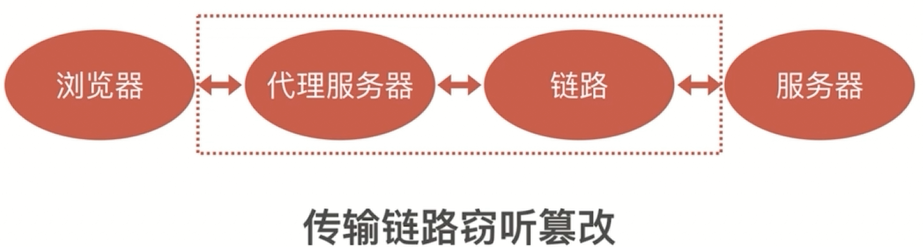
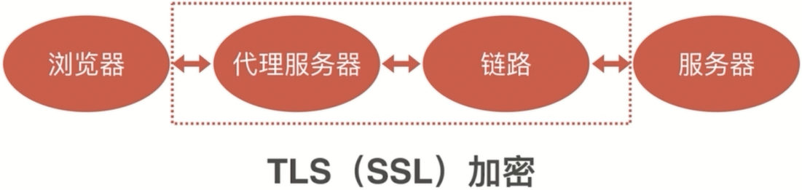
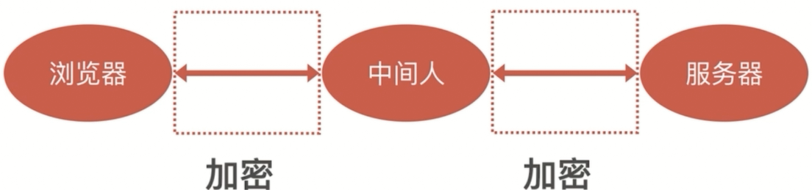
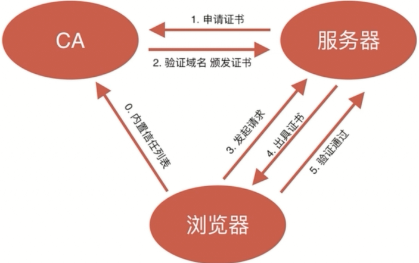

# HTTP传输窃听，篡改



http协议的传输是一种明文的方式进行传输。在http请求，中间会经过各种各样的网关、服务器节点，传输链路等，最终到达我们的目标服务器。在传输过程中的中间节点，都可以转发流量，数据。在转发过程中它是能够知道转发的数据是什么的，并且可以进行篡改。（这就是http进行明文传输的弊端），最后，服务端向你返回数据的时候，也是通过明文的方式是进行的

## HTTP传输窃听危害

- 窃听用户密码
- 获取用户敏感信息
- 非法获取个人资料

## HTTP传输篡改危害

- 插入广告
- 重定向网站
- 无法防御XSS攻击和CSRF攻击
- 广告运营商劫持
- 公共wifi获取密码，一定要注意，你的信息很可能不安全的

## HTTP传输窃听，篡改解决方法

- https是对http协议的一种解决方案
- http被窃听和篡改的原因，就是http是明文传输的。所以可以对数据进行加密处理
- 我们对HTTP进行加密，加密的方式就是TLS协议（传输层加密），TLS在之前的叫法就是SSL
- 但是也会存在```中间人攻击```问题

  

  ```javascript
  HTTP + TLS（SSL）=> HTTPS
  ```

## 中间人攻击

浏览器对数据进行加密，通过中间人与服务器进行通信。中间人可以解密浏览器的信息，然后加密后发送给服务器。同时中间人也可以解密服务器的信息，然后加密后发送给浏览器。这样也会受到http的窃听和篡改风险



## 中间人攻击解决方法

- CA证书机制：浏览器会有一个CA证书列表，表示我们的网站是安全的。服务器需要向CA证书发布的机构进行证书申请。得到这个CA证书。那么浏览器访问你的网站的时候，它就会向你的服务对比CA证书的信任情况，如果信任的网站，它就会正常访问

  

CA证书必须保证安全的重要原则：

- 证书是无法伪造的
- 证书私钥不能被泄漏
- 域名管理权不能泄漏
- CA坚守原则